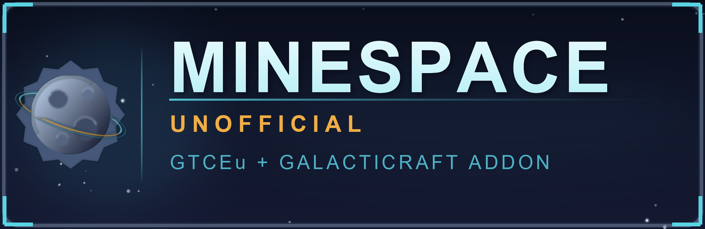

# Minespace Unofficial — GTCEu + Galacticraft addon workspace



Minecraft **1.12.2** / Forge **14.23.5.2859** development workspace for a **GregTech CE:
Unofficial** and **Galacticraft** addon mod.

**Status: working.** The addon compiles against both APIs and runs in the game:
it registers GregTech materials, GTCEu generates their items, and the read-back check
prints `minespace.material.desh_steel Ingot`.

## What the addon adds

An unofficial bridge between GregTech CE: Unofficial and Galacticraft, so industry and
space travel share one tech tree instead of ignoring each other:

- **GregTech materials.** `desh_steel` and `meteoric_iron` are registered with GTCEu,
  which then generates their ingots, dusts, plates, gears and fluids - plus the ore
  dictionary entries and processing recipes - without this mod shipping a single item.
- **GregTech machines.** The Oxygen Compressor, plus the Rocket Fuel Loader when
  Galacticraft is installed. Both go into GTCEu's machine registry (item form
  `gregtech:machine:32000+`), so they sit in GT's creative tab and JEI on their own.
- **Planet rocks and ores.** Moon, Mars, Venus and asteroid rock blocks, GT stone types
  bound to them for correct ore rendering, and the `GameRegistry.generateWorld` hook
  Galacticraft's planet chunk providers never call - without it no GT vein generates on
  any planet.
- **EU <-> gJ energy bridge.** `MinespaceGalacticraft.GcEnergyBridge` implements
  Galacticraft's `IEnergyStorageGC`, so GC machines can draw from a GregTech EU buffer.

The logo at the top of this file is the same image the mod list shows, and it is generated
rather than hand-drawn: `python tools/make-logo.py` re-renders `src/main/resources/logo.png`
and the 4x copy in `docs/`. It is authored at 400x130 on purpose - Forge fits mod-list logos
into a 200x65 box, so a 2:1 source downscales cleanly. Needs Pillow.

> **新会话 / 接手请先读 [HANDOFF.md](HANDOFF.md)** —— 里面有当前状态、环境事实、下一步
> 可做的事，以及"别做的事"。动手改代码前另读 [DEV-NOTES.md](DEV-NOTES.md)。

---

## 目录结构

单一 git 仓库（`github.com/yexiaosha/MineSpace-Unofficial`），两个工程同级：

```
MineSpace-Unofficial\                  <- git 仓库根
├─ .gitignore  .gitattributes         行尾与忽略规则
├─ README.md                          仓库总览、两步初始化
│
├─ Minespace-unofficial\              <- 本目录：附属模组工程
│  ├─ HANDOFF.md                      ★ 新会话入口
│  ├─ DEV-NOTES.md                    ★ 踩坑与 API 契约，动手前必读
│  ├─ src\main\java\com\minespace\unofficial\
│  │  ├─ Minespace.java               @Mod 入口、加载顺序契约
│  │  ├─ gtceu\MinespaceMaterials.java        格雷材质注册（核心示例）
│  │  ├─ galacticraft\MinespaceGalacticraft.java  星系整合 + EU<->gJ 能源桥
│  │  ├─ ModPresence.java             目标模组检测
│  │  └─ proxy\                       客户端/服务端代理
│  ├─ build.gradle                    附属模组依赖与测试任务
│  ├─ gradle.properties               版本与目标平台、pack_dir
│  └─ tools\                          本地工具链与脚本
│
└─ Minespace-unofficial-dev\          <- 可启动实例（附属模组的测试运行环境）
   ├─ mods\                           GTCEu / Galacticraft / CCL / KubeJS / 本附属模组
   ├─ Play-Minespace.bat              一键启动
   ├─ README.md                       实例说明 + KubeJS 1.12.2 用法
   └─ MOD-MANIFEST.md                 模组来源与版本清单
```

### 克隆后重建（工具链与大文件不在 git 里）

```powershell
cd Minespace-unofficial
.\tools\bootstrap.ps1          # 装 JDK 8 + Gradle + Git（约 700 MB）
.\tools\install-pack.ps1       # 装 Minecraft / Forge / 材质 / 库（约 360 MB）
.\tools\gradle.ps1 deployToInstance
```

两步都可重复运行，已完成的部分会自动跳过。

## 工具链

ForgeGradle 编译 1.12.2 **必须用 JDK 8**。工具链装在 `tools\` 下，**不写入系统 PATH
与注册表**，不影响这台机器上其他 Java 项目。

| 组件 | 版本 | 位置 |
| --- | --- | --- |
| JDK 8 | Temurin 1.8.0_504 | `tools\jdk8` |
| Gradle | 4.10.3 | `tools\gradle-4.10.3` |
| Git | 2.47.1 | `tools\git` |

重建：`.\tools\bootstrap.ps1`（可重复运行）。启用：`. .\tools\env.ps1`。

## 日常开发

```powershell
# 编译 + 重新混淆
.\tools\gradle.ps1 build

# 编译 + 部署到实例（推荐：这是本机唯一可靠的调试回路）
.\tools\gradle.ps1 deployToInstance
..\Minespace-unofficial-dev\Play-Minespace.bat

# 二分定位加载失败
.\tools\gradle.ps1 installMods -PskipMods=gregtech
```

> **`runClient` 在本机不可用**：ForgeGradle 3 的 userdev 客户端在加载 GTCEu /
> Galacticraft 时会在 FML 的 `NetworkRegistry` 处 NPE 崩溃。已排查到具体行号与成因，
> 详见 [DEV-NOTES.md](DEV-NOTES.md) 第 3 节。所以调试走 `deployToInstance` + 实例启动。

## 目标模组

| 模组 | 版本 | modid | 关系 |
| --- | --- | --- | --- |
| GregTech CE: Unofficial | 2.8.10-beta | `gregtech` | **必需**（`required-after`） |
| CodeChicken Lib | 3.2.3.358 | `codechickenlib` | **必需**（GTCEu 的硬前置） |
| Galacticraft Legacy | 4.0.7 | `galacticraftcore` | 可选（`after`，自带 MicdoodleCore） |
| KubeJS | 1.1.0.65 | `kubejs` | 不在构建依赖里；装在实例中用于免编译试配方 |

`build.gradle` 里用 CurseMaven 坐标 + `fg.deobf()` 接入。注意两点：

- 用的是自定义 `mods` 配置而不是 `implementation`，且 `installMods` 会把**反混淆后**的
  jar 放进 `run/mods`。这是必需的：FML 只会在正常 mod 发现流程中注册核心模组自带的
  mod id（Galacticraft 硬依赖的 `micdoodlecore`），放在启动 classpath 上会报
  `requires [micdoodlecore]`；只放 classpath 又会 `DuplicateModsFoundException`。
- ForgeGradle 3 没有 `deobfCompile`。正确写法是 `fg.deobf('坐标')`。
  `fg.deobf(files(...))` **不支持**（`Cannot deobfuscate dependency of type
  DefaultSelfResolvingDependency`）。

## 附属模组开发要点（摘要）

完整说明与踩坑记录见 [DEV-NOTES.md](DEV-NOTES.md)。三条最容易踩的：

1. **材质注册表不能在 `preInit` 里建**。GTCEu 在自己的 preInit 里走完
   `PRE → OPEN → CLOSED → FROZEN`，因为 `required-after:gregtech`，等你的 preInit 执行时
   已经是 FROZEN，会抛 `Cannot create registries in phase FROZEN`。
   正确做法：`MaterialRegistryEvent` 里 `createRegistry()`，`MaterialEvent` 里
   `new Material.Builder(...).build()`。
2. **`build()` 已自动注册**，不要再调 `registry.register()`，否则报一个看起来像自冲突的
   `Tried to reassign id ... to desh_steel ... already assigned to desh_steel`。
3. **`getMaterial()` 要用带命名空间的键**（`minespace:desh_steel`）。传裸路径会静默返回
   null，看起来和"没注册成功"一模一样。

另外：材质处理器里**不要用 `Minespace.log()`**——此时它还是 null（GTCEu 的 preInit 先跑），
会抛出伪装成"GregTech 崩溃"的 NPE。用即时的 log4j logger。

## 已验证 / 未完成

**已验证**

- 附属模组编译通过（对 GTCEu 与 GC 的真实 API，非猜测）
- 实例实机启动成功：11 个模组加载，本附属模组注册 2 个格雷材质
- GTCEu 为材质生成了物品：`GTCEu material check: desh_steel ingot -> minespace.material.desh_steel Ingot`
- 实例内 KubeJS 的 5 个示例脚本全部加载（`Loaded 5/5 scripts`）；1.12.2 的脚本写法差异见
  [实例 README](../Minespace-unofficial-dev/README.md)

**未完成（有意留白，避免交付半成品）**

- 自定义格雷机器（`MetaTileEntity`）：基类与注册入口已确认，但机器需要自己的
  `ModularUI`，工作量超出本轮可验证范围
- Galacticraft 的 `TileEntity` 子类化：因此 EU→gJ 能源桥
  （`MinespaceGalacticraft.GcEnergyBridge`）是**给你在自己的方块实体里实现**的适配器，
  而不是一个成品方块
- 新增星系天体/维度：`GalaxyRegistry.registerMoon` 等入口可用，但还需要 WorldProvider
  与维度注册才有意义，故未附带
- 材质的矿石生成：目前只有 `ingot` / `dust` / `fluid` 前缀，未接入 GTCEu 的矿脉系统

下一步的完整清单见 [HANDOFF.md](HANDOFF.md) 第 6 节。
